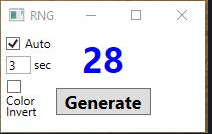

**Custom Random Number Generator**

## Features
1. Resizable. 
2. Changes color based on number from 0 to 100. Can invert color scheme
3. Toggle between Automatic Number Generationand Manual Generation. Can change default automatic time from 5 seconds to any whole number from 1 to 60 seconds.

## Steps
1. Click the green "code" button on this repo and download this code as a .zip. Then extract to a folder of your choosing.
2. Go to CustomRNG --> bin --> debug --> net6.0-windows --> CustomRNG.exe
3. Must right click 'CustomRNG.exe and 'Send to' desktop. CANNOT simply be copy pasted.
4. Once the '.exe' is on your desktop, you can rename it and move it to any folder or place you would like.

***THIS WPF .NET FRAMEWORK APP CAN ONLY BE RUN ON WINDOWS DEVICES***
